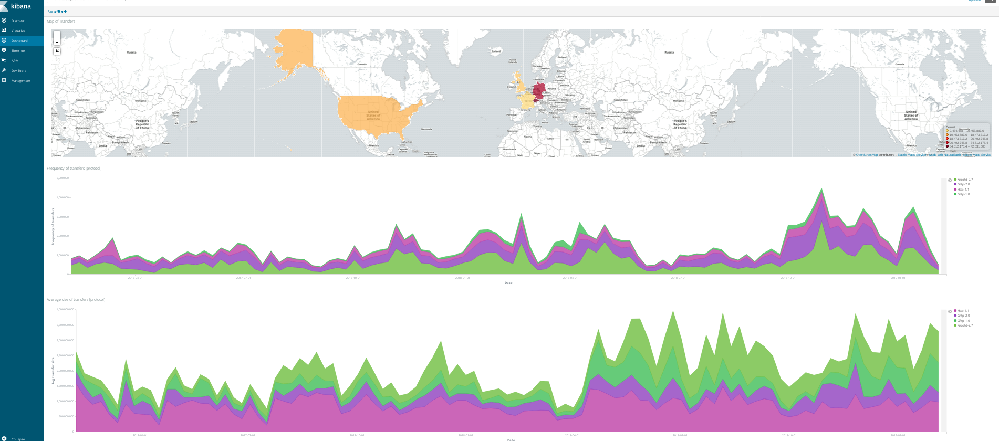
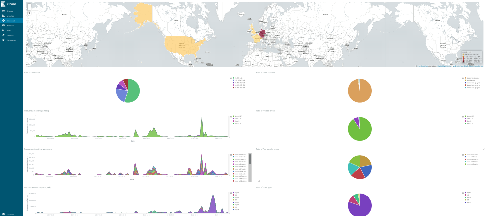
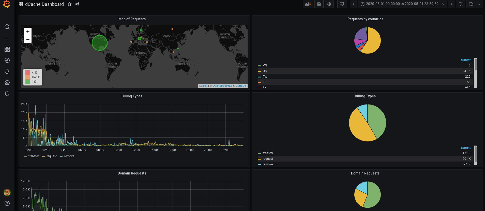
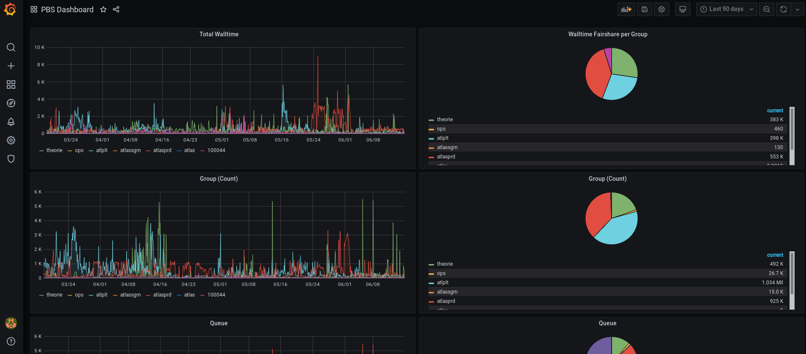

# Kibana

Kibana is an open source analytics and visualization platform designed to work with Elasticsearch [4][6]. We use Kibana to search, view, and interact with data stored in Elasticsearch indices. We can easily perform the data analysis and visualize our data in a variety of charts, tables, and maps. Kibana makes a large local site easy to understand large volumes of data, for instance, dCache billing log. Its simple, browser-based interface enables you to quickly create and share dynamic dashboards that display changes to Elasticsearch queries in real time. As default, our 'docker-welt' command with a 'tier2_ELK' option provide an Kibana instance and a port mapping of 20261.

# Grafana
Grafana is a multi-platform open source analytics and interactive visualization web application. It provides charts, graphs, and alerts for the web when connected to supported data sources. It is expandable through a plug-in system. End users can create complex monitoring dashboards using interactive query builders. As a visualization tool, Grafana is a popular component in monitoring stacks often used in combination with time series databases such as InfluxDB, Prometheus and Graphite; monitoring platforms such as Sensu, Icinga, Zabbix, Netdata and PRTG; SIEMs such as Elasticsearch and Splunk; and other data sources. Our 'docker-welt' command with a 'tier2_ELK' option provide an Kibana instance and a port mapping of 20261. The data source is from Elasticsearch.

