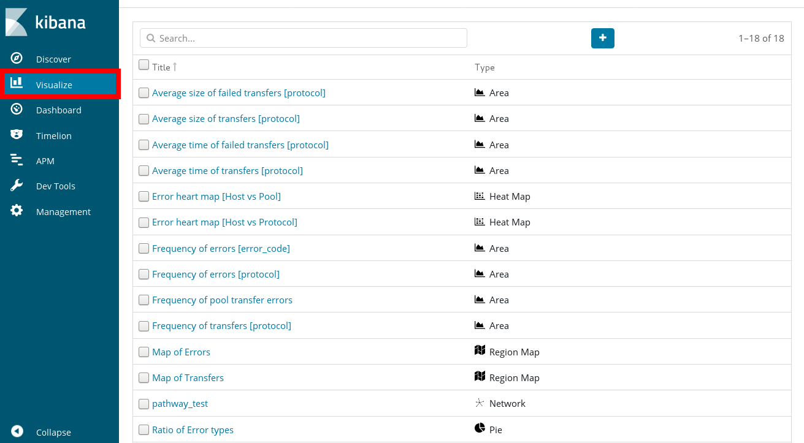
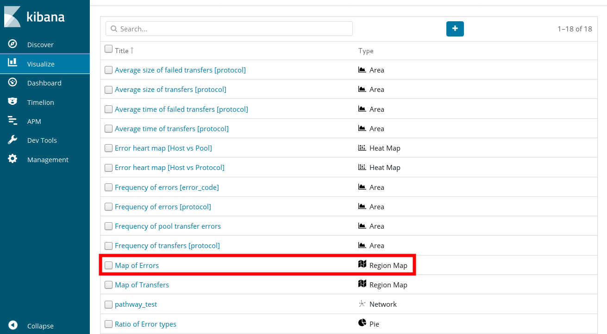
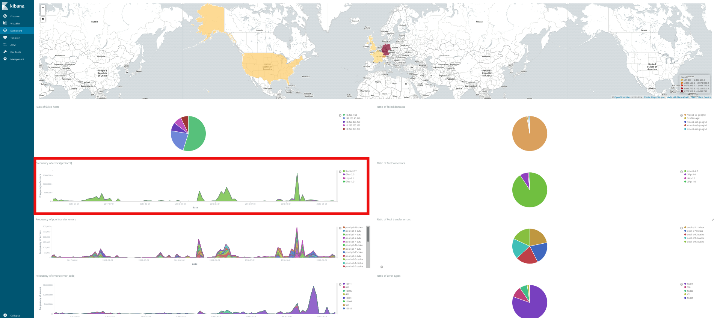

# Cookbook

## Running ELK stack in a ATLAS Tier2 site

* Cloning the main command and generating ELK templates

    $  git clone https://github.com/GenKawamura/docker-welt.git

    $  cd docker-welt

    $  ./docker-welt -C -r tier2_ELK

    $ ls workarea/tier2_ELK/GoeGridELK

    arcce_log  dcache_billing  elasticsearch_index_data  grafana  htcondor_eventlog  pbs_log

* Copy dCache/ARC/HTCondor/PBS logs into the billing directory (Note: indices will be kept in the 'elasticsearch_index_data' directory)

* Logstash instance send the log information to Elasticsearch instance. A port 20261 is used for Kibana and a port 20262 is used for Grafana.

    $ docker ps

## Manipulating Kibana Visualisation

The Kibana web interface contains under the menu point "Visualize" tab listing from all plots we created. The visualisation plots can also be redirected.

## Manipulating Kibana Dashboard

Each visualisation plot is gathered and sorted by the main dashboard, so that one changes the visualisation plot it will affect the dashboard view.

## Saving Kibana dashboard
In our case, we implemented our own darshboard (ID: WeXmuoICywmhE8FvCht). So, exporting the JSON output, and re-using it when the service is up again.

     $ id=WeXmuoICywmhE8FvCht
     $ export_url="http://localhost:20261/api/kibana/dashboards/export?dashboard=$id"
     $ GET "$export_url" > export.json

     $ import_url="http://localhost:20261/api/kibana/dashboards/import"
     $ curl -u elastic:changeme -k -XPOST "$import_url" \
         -H 'Content-Type: application/json' -H "kbn-xsrf: true" -d @export.json

## Command snippets for Elasticsearch
There are many client tools for Elasticsearch. These can most easily be communicated through RESTful web service in Elasticsearch engine.

* List indexes

     $ curl -XGET http://localhost:9200/_cat/indices?v

* Simple search in PBS log (show json structures)

     $ curl -XGET 'localhost:9200/pbs/_search?&pretty=true&size=1000'

* Simple search in dCache billing log

     $ curl -XGET 'localhost:9200/dcache-billing-2020.05/_search?pretty=true&size=1000'

* Filter if 'status' in PBS is 'E'

     $ curl -XGET 'localhost:9200/pbs/_search?q=status:E&pretty=true&size=1000'

* Filter if 'error_code' in dCache log is not '0'

     $ curl -XGET 'localhost:9200/dcache-billing-2020.05/_search?q=!(error_code:0)&pretty=true&size=1000'

* Show mapping structure (A definition of the PBS index)

     $ curl localhost:9200/pbs/_mapping?pretty

* Simple matches using pool_name in 'billing log'

     $ curl -XPOST 'localhost:9200/_search?pretty=true' -d '{"query": { "match_all": {} } }'

     $ curl -XPOST 'localhost:9200/_search?pretty=true' -d '{"query": { "match": { "pool_name": "pool-p1-1-data" } } }'

* Aggregations

     $ curl -XPOST 'localhost:9200/_search' -d '{"aggs": { "all_interests": { "terms": {"field": "size"} } } }'
     $ curl -XPOST 'localhost:9200/_search' -d '{"aggs": { "queries": { "terms": {"field": "size"} } } }'
     
     $ curl -XPOST 'localhost:9200/_search' -d '{"query": { "match": { "pool_name": "pool-p1-1-data" } }, "aggs": { "all_interests": { "terms": {"field": "size"} } } }'
     $ curl -XPOST 'localhost:9200/_search' -d '{"query": { "match": { "pool_name": "pool-p1-1-data" } }, "aggs": { "queries": { "terms": {"field": "size"} } } }'

